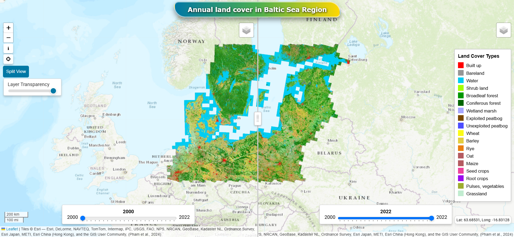

# Webmap BSRLC+
a Webmap to present annual land cover dataset for the Baltic Sea Region with crop types and peat bogs at 30 m from 2000 to 2022

<h2>Credit</h2>

 👨‍🏫 The project developed by <a href='https://vietducng.github.io/'>Viet Nguyen</a> (<a href = 'https://geo.uni-greifswald.de/en/chairs/geographie/translate-to-english-fernerkundung-und-geoinformationsverarbeitung/translate-to-english-team/'>University of Greifswald | Institute of Geography and Geology</a>).

<h2>Source</h2>
<h4>🔬 An annual land cover dataset for the Baltic Sea Region with crop types and peat bogs at 30m from 2000 to 2022</h4>
<i>Vu-Dong Pham, Farina de Waard, Fabian Thiel, Bernd Bobertz, Christina Hellmann, Duc-Viet Nguyen, Felix Beer, M. Arasumani, Marcel Schwieder, Jörg Hartleib, David Frantz & Sebastian van der Linden</i>
 DOI: <a href="https://doi.org/10.1038/s41597-024-04062-w">https://doi.org/10.1038/s41597-024-04062-w</a>
 Data: <a href="https://zenodo.org/records/10653871">https://zenodo.org/records/10653871</a>